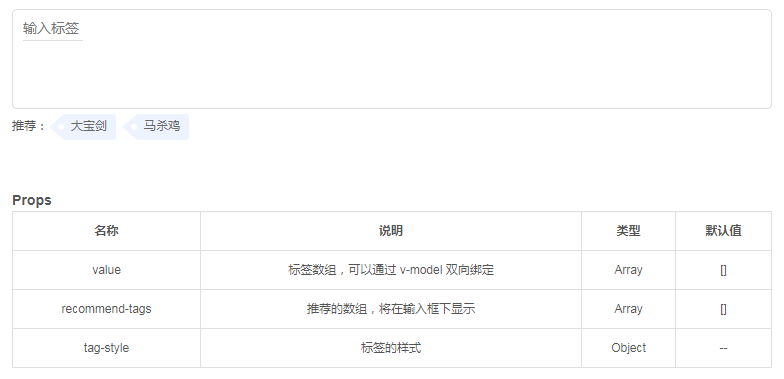

# iview-extended-components
Extended Components of iView

## usage
```js
import Vue from 'vue';
import iView from 'iview';
import iviewExtendedComponents from './iview-extended-components';
import 'iview/dist/styles/iview.css';

const extendediView = iviewExtendedComponents.extend(iView);
Vue.use(extendediView);
```
that is all.

## components

### number-input
> 这是一个数字输入框组件


### search-input
> 这是一个搜索输入框组件


### i-icon
> 用于除了 iview 自带的 `Icon` 组件外，App 本身业务 svg 需要。具体使用见：http://iconfont.cn/help/detail?spm=a313x.7781069.1998910419.d8cf4382a&helptype=code

示例
```html
<i-icon name="search" size="20" color="#ff6600"></i-icon>
```


### tag-input
> 标签输入框

示例
```html
<tag-input v-model="tags" :recommend-tags="recommendTags"></tag-input>
```

预览



### vue-echarts
通用 echarts 组件

### x-icon
自定义 icon 组件，可单独设置项目需要的图标